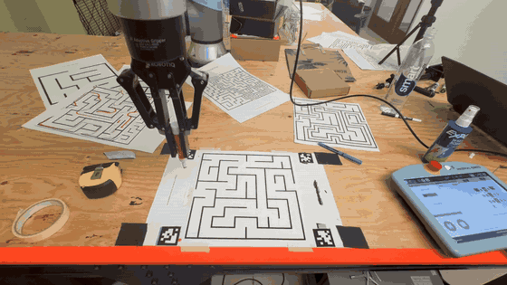
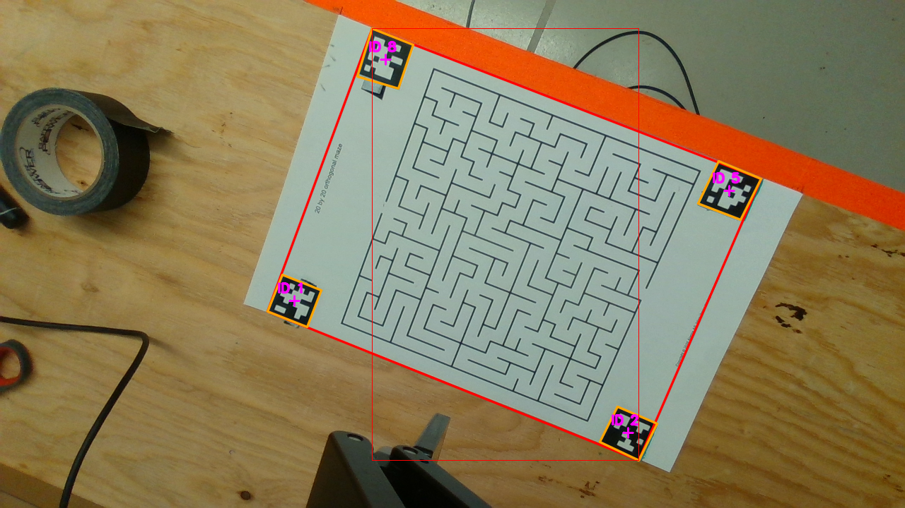
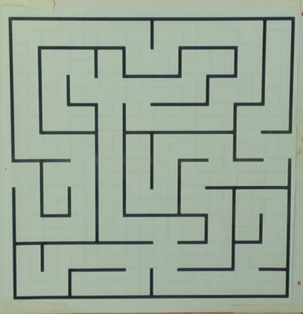
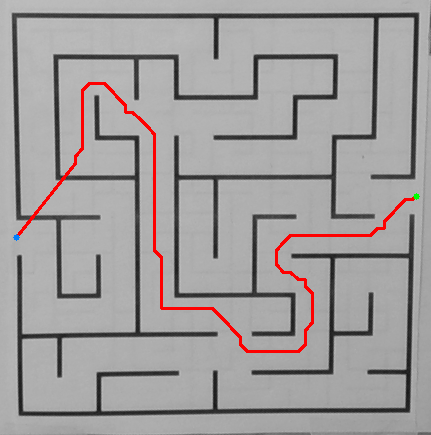
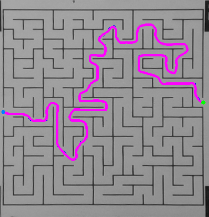

# UR10e Maze Solver

Autonomous maze solving and drawing with a UR10e robot arm. The system captures a maze image, rectifies it with AprilTags, solves it with A*, smooths the path, converts it to UR10e joint targets, and draws the solution with MPC velocity control.

## Demo

<p align="center">
  
</p>

Full video: [outputs/235b_final_demo_maze_solver (1).mp4](outputs/235b_final_demo_maze_solver%20(1).mp4)

## Pipeline

### 1. AprilTag localization

The robot moves to an overhead pose and captures a RealSense color image. AprilTags define the maze sheet.

<p align="center">
  
</p>

### 2. Homography rectification

The tag corners define a planar homography:

```text
p' ~ H p
```

This removes perspective distortion and gives the planner a flat maze image.

<p align="center">
  
</p>

Scale comes from the known AprilTag side length:

```text
meters_per_pixel = tag_side_meters / average_tag_edge_pixels
```

### 3. A* planning

The rectified image becomes a grid graph. Dark cells are walls, bright cells are free space, and walls are inflated for pen clearance. Boundary openings are validated so A* starts and ends at the real maze entrances.

<p align="center">
  
</p>

### 4. Spline smoothing

The raw A* path is smoothed before being sent to the robot.

<p align="center">
  
</p>

### 5. Robot transform and IK

Pixels are mapped into the robot base frame:

```text
p_base = T_base_tag * T_tag_maze * [u*s, v*s, 0, 1]^T
```

The desired pen pose is converted to UR10e joints using inverse kinematics:

```text
T_base_pen(q) = FK(q) * T_tcp_pen
```

The code uses a consistent elbow-up IK branch to avoid configuration flips.

### 6. MPC execution

The MPC tracks the joint trajectory with:

```text
q[k+1] = q[k] + dt * u[k]
```

It enforces joint velocity and acceleration limits. Static moves use `movej`; drawing uses streamed `speedj` velocity commands.

## Safety and CBFs

Safety tools are included but can be toggled for debugging.

- Runtime joint-limit and self-collision checks: `src/urx_control_thread.py`
- CBF constraints and QP filter: `src/cbf.py`
- MPC-side CBF toggle: `src/simulation.py`

Enable runtime safety checks:

```python
RUN_RUNTIME_SAFETY_CHECKS = True
```

Enable the CBF filter:

```python
ENABLE_CBF = True
```

The default CBF setup includes `EndpointHeightCBF`, which keeps the tool endpoint above a minimum height. `JointLimitCBF` is also implemented and can be added in `src/cbf.py`.

## Hardware

- UR10e robot arm
- Intel RealSense camera
- AprilTags
- Pen tool
- Printed maze

## Install

```bash
pip install -r requirements.txt
```

Main packages:

- `opencv-contrib-python`
- `pyrealsense2`
- `urx==0.11.0`
- `casadi`
- `numpy`
- `matplotlib`
- `PyYAML`
- `cvxpy`

## Run

Full robot run:

```bash
python3 -m src.combined_main --execute
```

Use an existing image:

```bash
python3 -m src.combined_main --no-capture --image outputs/captured_maze.png --execute
```

Planning only:

```bash
python3 -m src.combined_main --no-capture --image outputs/captured_maze.png
```

## Main Files

```text
src/combined_main.py        Main pipeline
src/maze_localizer.py       AprilTag detection and rectification
src/astar.py                Maze graph, opening detection, A*
src/mpc.py                  MPC controller
src/simulation.py           MPC loop and telemetry
src/urx_control_thread.py   UR10e commands
src/ur10e.py                Kinematics and IK
src/cbf.py                  CBF safety filters
```

## Outputs

```text
outputs/localized_input.png        AprilTag localization
outputs/maze_rectified.png         Rectified maze
outputs/astar_overlay.png          A* path
outputs/astar_spline_overlay.png   Smoothed path
outputs/joint_trajectory.npy       Joint trajectory
outputs/mpc_trace.npz              Robot and MPC telemetry
```

## Report

```text
report/UR10e_Maze_Solver.pdf
```
